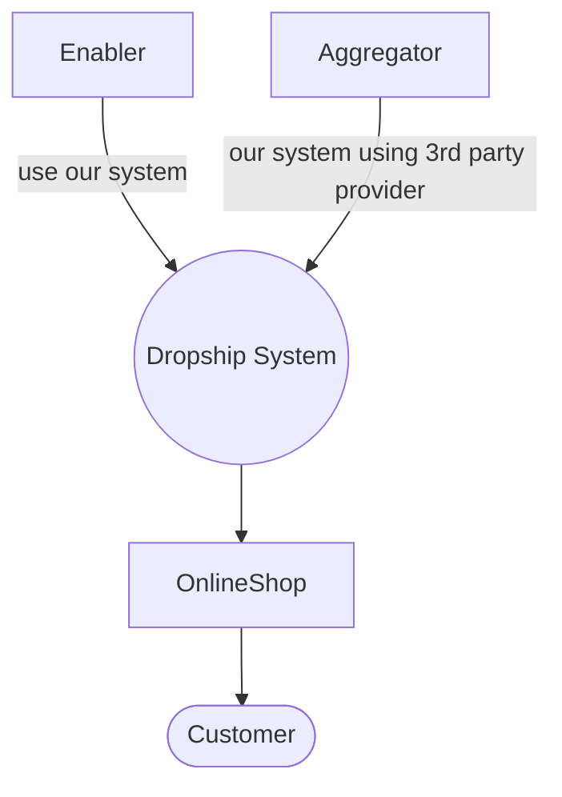

---
# try also 'default' to start simple
theme: seriph
# random image from a curated Unsplash collection by Anthony
# like them? see https://unsplash.com/collections/94734566/slidev
background: https://source.unsplash.com/collection/94734566/1920x1080
# apply any windi css classes to the current slide
class: 'text-center'
# https://sli.dev/custom/highlighters.html
highlighter: shiki
# show line numbers in code blocks
lineNumbers: false
# some information about the slides, markdown enabled
info: |
  ## Slidev Starter Template
  Presentation slides for developers.

  Learn more at [Sli.dev](https://sli.dev)
# persist drawings in exports and build
drawings:
  persist: false
# use UnoCSS (experimental)
css: unocss
---

# Dropship System di OnlineShop

(nama perusahaan disamarkan)

  
    Press Space for next page <carbon:arrow-right class="inline"/>
  

  <button @click="$slidev.nav.openInEditor()" title="Open in Editor" class="text-xl icon-btn opacity-50 !border-none !hover:text-white">
    <carbon:edit />
  </button>
  <a href="https://github.com/slidevjs/slidev" target="_blank" alt="GitHub"
    class="text-xl icon-btn opacity-50 !border-none !hover:text-white">
    <carbon-logo-github />
  </a>

---

# Business Model

- **OnlineShop** : Nama Perusahaan
- **Enabler** : Merchant dapat menjual barang dagangannya menggunakan sistem Dropship di OnlineShop, contoh : https://www.vinomofo.com/
- **Aggregator** : Sistem Dropship mendapat barang dagangan menggunakan API dari pihak ketiga, contoh : https://luxury-distribution.com/
- **Customer** : Pembeli membeli melalui website OnlineShop

 

